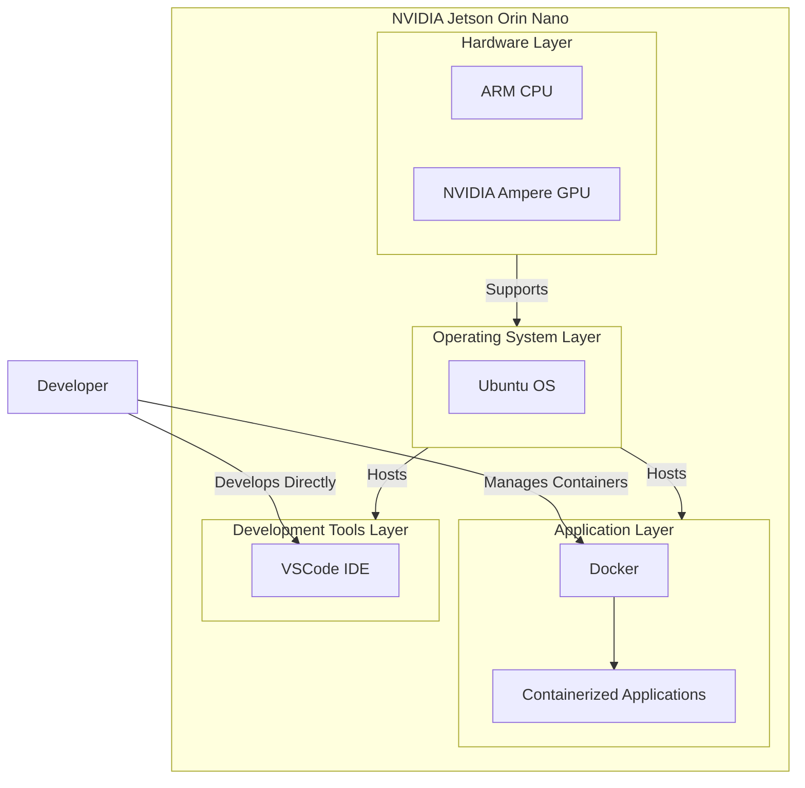
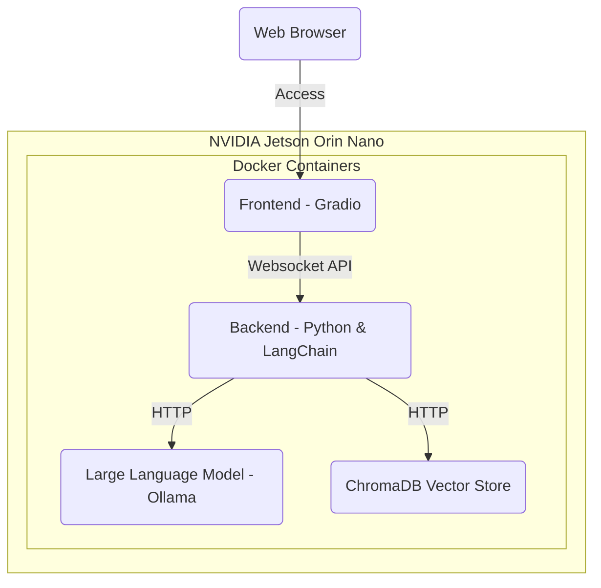
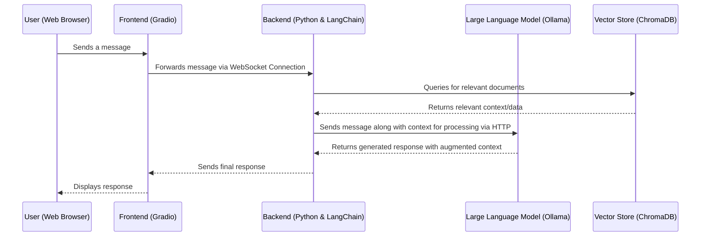

# Workshop: Build Your Own Chatbot

**Version:** 1.1.1

**Author:** Martin Kovacs 
**Contact:** martin.kovacs@web.de

**Author:** Johannes Baumgartl 
**Contact:** johannes.baumgartl@web.de


Welcome to the "Build Your Own Chatbot" workshop! This workshop will guide you through the process of creating a custom chatbot using Large Language Models (LLMs) as the core technology. By the end of this workshop, you'll have a functional chatbot that can serve as a personalized learning assistant, an interactive study tool, and a reliable support for exam preparation.

## Workshop Objectives

By participating in this workshop, you will achieve the following:

- **Personalized Learning Assistant**: Create a chatbot that acts as a learning tutor.
- **Interactive Study Tool**: Use lecture scripts, ask questions about the content, or generate exam-related questions.

## Overview

In this workshop, we will build a chatbot using an LLM as the core engine, complemented by a frontend and backend to provide a complete, user-friendly solution.

### Key Concepts

- **Frontend**: A graphical user interface (GUI) for interacting with the chatbot.
- **Backend**: Handles the core functionality and logic of the chatbot.
- **Retrieval-Augmented Generation (RAG)**: A hybrid approach that combines information retrieval with text generation to enhance chatbot responses.

Below is a diagram code that explains the general concept of Retrieval-Augmented Generation (RAG), which combines retrieval-based methods with generative models to enhance the generation of text responses.


### Developer Environment:



Here’s a textual explanation of the component architecture for the NVIDIA Jetson Orin Nano, organized in layers:

### 1. **Hardware Layer**
   - **ARM CPU**: The central processing unit responsible for general computing tasks.
   - **NVIDIA Ampere GPU**: The graphics processing unit optimized for parallel processing, crucial for AI and machine learning tasks.

### 2. **Operating System Layer**
   - **Ubuntu OS**: The operating system running on the NVIDIA Jetson Orin Nano, providing the base environment for all software components.

### 3. **Application Layer**
   - **Docker**: A platform for containerization that allows applications to run in isolated environments, ensuring consistency and flexibility.
   - **Containerized Applications**: The actual AI models and other applications that are developed, deployed, and executed within Docker containers on the Orin Nano.

### 4. **Development Tools Layer**
   - **VSCode IDE**: Visual Studio Code, the integrated development environment used by developers to write, debug, and manage code directly on the Orin Nano.

### **Developer Interaction**
   - The developer interacts directly with the VSCode IDE on the Orin Nano for coding and debugging.
   - The developer also manages Docker containers to deploy and run AI models and applications within the edge device.


### Target Architecture




### Components Explained

1. **NVIDIA Jetson Orin Nano**: The hardware platform hosting all Docker containers necessary for the chatbot.

2. **Docker Containers**:
    - **Frontend (Gradio)**: The user interface for interacting with the chatbot.
    - **Backend (Python & LangChain)**: Manages chatbot logic, processes inputs, and interfaces with other components.
    - **LLM (Ollama)**: Handles natural language processing tasks.
    - **VectorStore (ChromaDB Vector Store)**: Manages vector representations of text data for efficient querying.

3. **Development and Communication Flow**:
    - **Frontend to Backend**: Communication via Websocket API.
    - **Backend to LLM and VectorStore**: Interaction through HTTP requests.
    - **Remote Development**: Developers interact with the NVIDIA Jetson Orin Nano remotely for development purposes.

### User Interaction Flow



This diagram illustrates the flow of data during a typical user interaction with the chatbot, highlighting how the components communicate to generate and display responses.

## Getting Started

This repository serves as the project template for the workshop.

### Project Structure

Here’s a breakdown of the project structure with an explanation of each component:

```plaintext
.
├── Introduction
│   ├── Introduction Slides.pdf                 # Overview of the workshop, objectives, and agenda
│   ├── install_prerequisites_jetson_nano.md    # Step-by-step guide to install prerequisites on Jetson Nano
│   └── startup_dev_env.md                      # Instructions for setting up the development environment
├── README.md                                    # Main documentation file for the project
├── Session_1
│   ├── code
│   │   ├── 01_deploy_model.md                   # Instructions on deploying a machine learning model
│   │   ├── 02_tasks.ipynb                       # Jupyter Notebook with tasks for Session 1
│   │   └── 03_solutions.ipynb                   # Solutions for the tasks in Session 1
│   └── slides
│       └── Session 1 Slides.pdf                 # Presentation slides for Session 1
├── Session_2
│   ├── code
│   │   ├── 01_tasks.ipynb                       # Jupyter Notebook with tasks for Session 2
│   │   └── 02_solutions.ipynb                   # Solutions for the tasks in Session 2
│   └── slides
│       └── Session 2 Slides.pdf                 # Presentation slides for Session 2
├── Session_3
│   ├── code
│   │   ├── 01_deploy_chromadb.md                # Instructions to deploy ChromaDB
│   │   ├── 02_tasks.ipynb                       # Jupyter Notebook with tasks for Session 3
│   │   ├── 03_solutions.ipynb                   # Solutions for the tasks in Session 3
│   │   └── AI_Book.pdf                          # Reference materials for the knowledge base
│   └── slides
│       └── Session 3 Slides.pdf                 # Presentation slides for Session 3
├── Session_4
│   ├── code
│   │   ├── 01_tasks.ipynb                       # Jupyter Notebook with tasks for Session 4
│   │   └── 02_solutions.ipynb                   # Solutions for the tasks in Session 4
│   └── slides
│       └── Session 4 Slides.pdf                 # Presentation slides for Session 4
├── Session_5
│   ├── chatbot_solution
│   │   ├── README_CHATBOT.md                    # Documentation outlining the chatbot solution project
│   │   ├── backend
│   │   │   ├── Dockerfile.backend               # Dockerfile for backend services
│   │   │   ├── main.py                          # Main backend application logic
│   │   │   ├── pyproject.toml                   # Backend configuration file
│   │   │   ├── requirements-dev.lock            # Locked development dependencies for backend
│   │   │   ├── requirements.lock                # Locked production dependencies for backend
│   │   │   └── src
│   │   │       ├── AI_Book.pdf                  # Reference materials for the chatbot's knowledge base
│   │   │       ├── __init__.py                  # Initializes the backend Python package
│   │   │       └── bot.py                       # Core chatbot functionality and logic
│   │   ├── chroma                               # ChromaDB-related configurations and scripts
│   │   ├── docker-compose-jetson.yml            # Docker Compose configuration for Jetson Nano
│   │   ├── docker-compose.yml                   # Standard Docker Compose configuration for chatbot services
│   │   ├── frontend
│   │   │   ├── Dockerfile.frontend              # Dockerfile for frontend services
│   │   │   ├── app.py                           # Frontend application logic
│   │   │   ├── pyproject.toml                   # Frontend configuration file
│   │   │   ├── requirements-dev.lock            # Locked development dependencies for frontend
│   │   │   └── requirements.lock                # Locked production dependencies for frontend
│   ├── chatbot_task
│   │   ├── README_CHATBOT.md                    # Documentation outlining the chatbot task project for participants
│   │   ├── backend
│   │   │   ├── Dockerfile.backend               # Dockerfile for backend services
│   │   │   ├── main.py                          # Main backend application logic for the task
│   │   │   ├── pyproject.toml                   # Backend configuration file 
│   │   │   ├── requirements-dev.lock            # Locked development dependencies for backend 
│   │   │   ├── requirements.lock                # Locked production dependencies for backend 
│   │   │   └── src
│   │   │       ├── AI_Book.pdf                  # Reference materials for the chatbot's knowledge base 
│   │   │       ├── __init__.py                  # Initializes the backend Python package 
│   │   │       └── bot.py                       # Core chatbot functionality and logic 
│   │   ├── docker-compose-jetson.yml            # Docker Compose configuration for Jetson Nano 
│   │   ├── docker-compose.yml                   # Standard Docker Compose configuration for chatbot services 
│   │   └── frontend
│   │       ├── Dockerfile.frontend              # Dockerfile for frontend services 
│   │       ├── app.py                           # Frontend application logic 
│   │       ├── pyproject.toml                   # Frontend configuration file 
│   │       ├── requirements-dev.lock            # Locked development dependencies for frontend 
│   │       └── requirements.lock                # Locked production dependencies for frontend 
│   └── slides
│       └── Session 5 Slides.pdf                 # Presentation slides for Session 5
├── Workshop_Timeline.md                          # Detailed timeline outlining the workshop schedule
├── pyproject.toml                                # Configuration and metadata for the overall project
├── requirements-dev.lock                         # Locked development dependencies for consistent environments
└── requirements.lock                             # Locked production dependencies for consistent deployments
```

---

### Tools and Technologies

The project utilizes the following tools and technologies:

- **[Rye](https://rye.astral.sh/)**: Manages dependencies and virtual environments.
- **[Pytest](https://docs.pytest.org/)**: Framework for writing and running unit tests.
- **[Pyright](https://microsoft.github.io/pyright/)**: Static type checker and linter for Python.
- **[Ruff](https://docs.astral.sh/ruff/)**: Linter configured in the `pyproject.toml` file.
- **[Pre-Commit](https://pre-commit.com/)**: Tool for running checks before committing code.

### Tool Installation

1. **Install Rye**: Follow the [Rye installation guide](https://rye.astral.sh/guide/installation/).
2. **Install Dependencies**:
   - Sync the project dependencies within a virtual environment:
     ```sh
     rye sync
     ```
   - **Alternatively**, install dependencies manually:
     ```sh
     pip install -r requirements.lock
     pip install -r requirements-dev.lock
     ```

3. **Configure Python Interpreter**: Set your VSCode to use the `.venv` environment created by Rye.
4. **Set Up Environment Variables**:
   - Duplicate the `.env.example` file and rename it to `.env`.
   - Fill in the required fields in the `.env` file.

### Project Configuration

Update the project metadata in `pyproject.toml`:

```toml
[project]
description = "Add your description here"
authors = [
    { name = "Max", email = "Max@example-project-with-rye.com" }
]
```

## Usage

<details>
<summary><b><span style="font-size: large;">Additional Developer Commands (Click to expand)</span></b></summary>

### Dependency Management

- **Add LangChain as a regular dependency**:
  ```sh
  rye add langchain
  ```

- **Add Pytest as a development dependency**:
  ```sh
  rye add pytest --dev
  ```

- **Update a specific package**:
  ```sh
  rye sync --update langchain
  ```

- **Update all packages**:
  ```sh
  rye sync --update-all
  ```

- **Update Rye itself**:
  ```sh
  rye self update
  ```

### Code Quality and Formatting

- **Linting**: Find and automatically fix lint errors:
  ```sh
  rye lint --fix
  ```

- **Static Type Checking**:
  ```sh
  pyright
  ```

- **Auto-Format Code**:
  ```sh
  rye fmt
  ```

### Pre-Commit Hooks

- **Install Pre-Commit Hooks**: Automatically run checks before each commit.
  ```sh
  pre-commit install --hook-type pre-commit
  ```

- **Run Pre-Commit Hooks on Staged Files**:
  ```sh
  pre-commit run
  ```

- **Run Pre-Commit Hooks on All Files**:
  ```sh
  pre-commit run --all-files
  ```

- **Update Pre-Commit Hooks**:
  ```sh
  pre-commit autoupdate
  ```

</details>

---