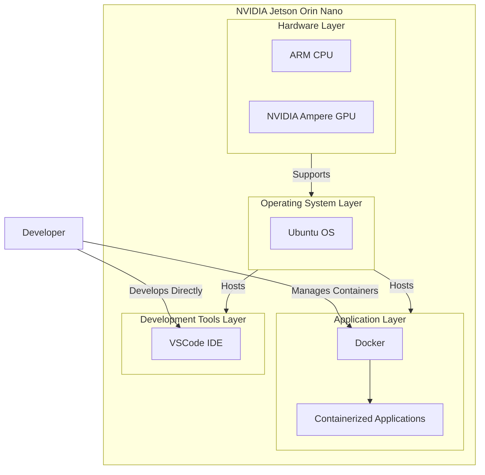
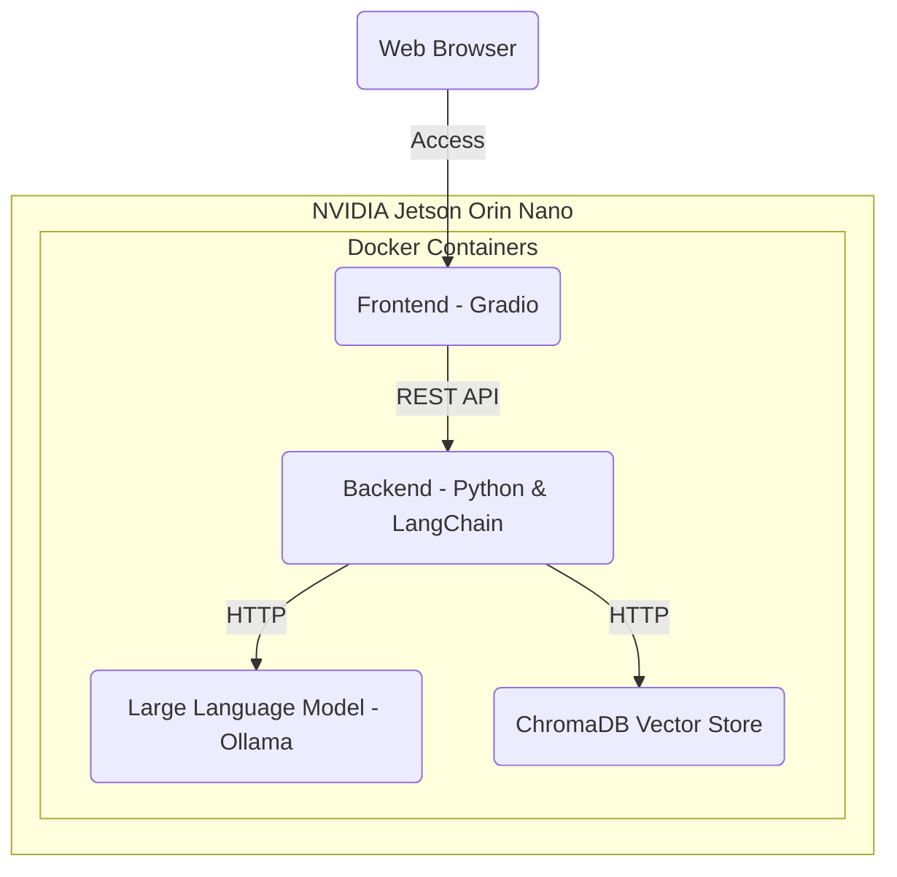
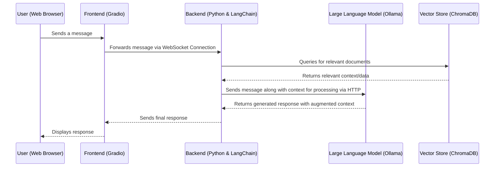

# Workshop: Build Your Own Chatbot

Welcome to the "Build Your Own Chatbot" workshop! This workshop will guide you through the process of creating a custom chatbot using Large Language Models (LLMs) as the core technology. By the end of this workshop, you'll have a functional chatbot that can serve as a personalized learning assistant, an interactive study tool, and a reliable support for exam preparation.

## Workshop Objectives

By participating in this workshop, you will achieve the following:

- **Personalized Learning Assistant**: Create a chatbot that acts as a learning tutor.
- **Interactive Study Tool**: Upload lecture scripts, ask questions about the content, or generate exam-related questions.
- **Exam Preparation Support**: Use the chatbot to reinforce your understanding of key topics.

## Overview

In this workshop, we will build a chatbot using an LLM as the core engine, complemented by a frontend and backend to provide a complete, user-friendly solution.

### Key Concepts

- **Frontend**: A graphical user interface (GUI) for interacting with the chatbot.
- **Backend**: Handles the core functionality and logic of the chatbot.
- **Retrieval-Augmented Generation (RAG)**: A hybrid approach that combines information retrieval with text generation to enhance chatbot responses.

Below is a diagram code that explains the general concept of Retrieval-Augmented Generation (RAG), which combines retrieval-based methods with generative models to enhance the generation of text responses.


### Developer Environment:



Here’s a textual explanation of the component architecture for the NVIDIA Jetson Orin Nano, organized in layers:

### 1. **Hardware Layer**
   - **ARM CPU**: The central processing unit responsible for general computing tasks.
   - **NVIDIA Ampere GPU**: The graphics processing unit optimized for parallel processing, crucial for AI and machine learning tasks.

### 2. **Operating System Layer**
   - **Ubuntu OS**: The operating system running on the NVIDIA Jetson Orin Nano, providing the base environment for all software components.

### 3. **Application Layer**
   - **Docker**: A platform for containerization that allows applications to run in isolated environments, ensuring consistency and flexibility.
   - **Containerized Applications**: The actual AI models and other applications that are developed, deployed, and executed within Docker containers on the Orin Nano.

### 4. **Development Tools Layer**
   - **VSCode IDE**: Visual Studio Code, the integrated development environment used by developers to write, debug, and manage code directly on the Orin Nano.

### **Developer Interaction**
   - The developer interacts directly with the VSCode IDE on the Orin Nano for coding and debugging.
   - The developer also manages Docker containers to deploy and run AI models and applications within the edge device.


### Target Architecture




### Components Explained

1. **NVIDIA Jetson Orin Nano**: The hardware platform hosting all Docker containers necessary for the chatbot.

2. **Docker Containers**:
    - **Frontend (Gradio)**: The user interface for interacting with the chatbot.
    - **Backend (Python & LangChain)**: Manages chatbot logic, processes inputs, and interfaces with other components.
    - **LLM (Ollama)**: Handles natural language processing tasks.
    - **VectorStore (ChromaDB Vector Store)**: Manages vector representations of text data for efficient querying.

3. **Development and Communication Flow**:
    - **Frontend to Backend**: Communication via REST API.
    - **Backend to LLM and VectorStore**: Interaction through HTTP requests.
    - **Remote Development**: Developers interact with the NVIDIA Jetson Orin Nano remotely for development purposes.

### User Interaction Flow



This diagram illustrates the flow of data during a typical user interaction with the chatbot, highlighting how the components communicate to generate and display responses.

## Getting Started

This repository serves as the project template for the workshop.

### Project Structure

Here’s a breakdown of the project structure with an explanation of each component:

```plaintext
├── .devcontainer
│   └── devcontainer.json               # Configuration for the development container setup
├── .editorconfig                        # EditorConfig file for maintaining consistent coding styles across editors
├── .env.example                         # Example environment configuration file
├── .github
│   └── workflows
│       └── checks.yml                   # GitHub Actions workflow for automated checks (linting, testing, etc.)
├── .gitignore                           # Git ignore file to specify files and directories to be ignored by Git
├── .pre-commit-config.yaml              # Configuration for pre-commit hooks
├── pyproject.toml                       # Project metadata and configuration file for Python packaging and tools
├── .python-version                      # Specifies the Python version used in the project
├── README.md                            # Project README file
├── requirements-dev.lock                # Locked file for development dependencies
├── requirements.lock                    # Locked file for project dependencies
├── src
│   ├── chatbot
│   │   ├── backend                      # Backend code (e.g., APIs, database interaction, business logic)
│   │   └── frontend                     # Frontend code (e.g., UI components, Gradio interface)
│   └── prototyping                      # Prototyping code and scripts for initial experiments
└── tests
    └── test_aaa.py                      # Unit tests for the project (following Pytest conventions)
```

**Explanation of the Project Structure**

- **`.devcontainer/`**: Contains the `devcontainer.json` configuration, which sets up a consistent development environment using Visual Studio Code’s Dev Containers feature. This ensures that all developers work within the same environment, reducing "it works on my machine" issues.

- **`.editorconfig`**: A file that helps maintain consistent coding styles between different editors and IDEs. It defines rules like indentation styles, line endings, and more.

- **`.env.example`**: An example of the environment variables required for the project. Developers should copy this file to `.env` and fill in their specific values.

- **`.github/`**: Contains GitHub Actions workflows. The `checks.yml` file defines automated actions like linting, testing, and other checks that run on pull requests to maintain code quality.

- **`.gitignore`**: Specifies which files and directories should be ignored by Git, preventing sensitive or unnecessary files from being committed to the repository.

- **`.pre-commit-config.yaml`**: Configuration file for Pre-Commit hooks, which run automated checks (like linting and formatting) before code is committed to the repository.

- **`pyproject.toml`**: A configuration file that contains project metadata, dependency management, and configurations for various tools like Rye, Pyright, and Ruff. This is the core configuration file for the project.

- **`.python-version`**: Specifies the version of Python to be used for the project, ensuring consistency across different environments.

- **`README.md`**: The primary documentation file for the project, containing an overview, setup instructions, usage guidelines, and more.

- **`requirements-dev.lock` & `requirements.lock`**: Locked versions of the project’s dependencies, ensuring that everyone uses the exact same versions of libraries and tools, avoiding compatibility issues.

- **`src/`**: The source directory containing all the main code for the project.
  - **`chatbot/`**: Contains the core chatbot code.
    - **`backend/`**: Handles all backend-related tasks like API logic, data handling, and business logic.
    - **`frontend/`**: Contains the frontend code, particularly the Gradio interface used for interacting with the chatbot.
  - **`prototyping/`**: Used for initial experiments and prototypes, allowing developers to try out ideas before integrating them into the main codebase.

- **`tests/`**: Contains unit tests for the project, ensuring that all components work as expected. The tests follow the Pytest conventions, with files prefixed by `test_`.

### Tools and Technologies

The project utilizes the following tools and technologies:

- **[Rye](https://rye.astral.sh/)**: Manages dependencies and virtual environments.
- **[Pytest](https://docs.pytest.org/)**: Framework for writing and running unit tests.
- **[Pyright](https://microsoft.github.io/pyright/)**: Static type checker and linter for Python.
- **[Ruff](https://docs.astral.sh/ruff/)**: Linter configured in the `pyproject.toml` file.
- **[Pre-Commit](https://pre-commit.com/)**: Tool for running checks before committing code.

### Tool Installation

1. **Install Rye**: Follow the [Rye installation guide](https://rye.astral.sh/guide/installation/).
2. **Install Dependencies**:
   - Sync the project dependencies within a virtual environment:
     ```sh
     rye sync
     ```
   - **Alternatively**, install dependencies manually:
     ```sh
     pip install -r requirements.lock
     pip install -r requirements-dev.lock
     ```

3. **Configure Python Interpreter**: Set your VSCode to use the `.venv` environment created by Rye.
4. **Set Up Environment Variables**:
   - Duplicate the `.env.example` file and rename it to `.env`.
   - Fill in the required fields in the `.env` file.

### Project Configuration

Update the project metadata in `pyproject.toml`:

```toml
[project]
description = "Add your description here"
authors = [
    { name = "Max", email = "Max@example-project-with-rye.com" }
]
```

## Usage

<details>
<summary><b><span style="font-size: large;">Additional Developer Commands (Click to expand)</span></b></summary>

### Dependency Management

- **Add LangChain as a regular dependency**:
  ```sh
  rye add langchain
  ```

- **Add Pytest as a development dependency**:
  ```sh
  rye add pytest --dev
  ```

- **Update a specific package**:
  ```sh
  rye sync --update langchain
  ```

- **Update all packages**:
  ```sh
  rye sync --update-all
  ```

- **Update Rye itself**:
  ```sh
  rye self update
  ```

### Code Quality and Formatting

- **Linting**: Find and automatically fix lint errors:
  ```sh
  rye lint --fix
  ```

- **Static Type Checking**:
  ```sh
  pyright
  ```

- **Auto-Format Code**:
  ```sh
  rye fmt
  ```

### Pre-Commit Hooks

- **Install Pre-Commit Hooks**: Automatically run checks before each commit.
  ```sh
  pre-commit install --hook-type pre-commit
  ```

- **Run Pre-Commit Hooks on Staged Files**:
  ```sh
  pre-commit run
  ```

- **Run Pre-Commit Hooks on All Files**:
  ```sh
  pre-commit run --all-files
  ```

- **Update Pre-Commit Hooks**:
  ```sh
  pre-commit autoupdate
  ```

</details>

---