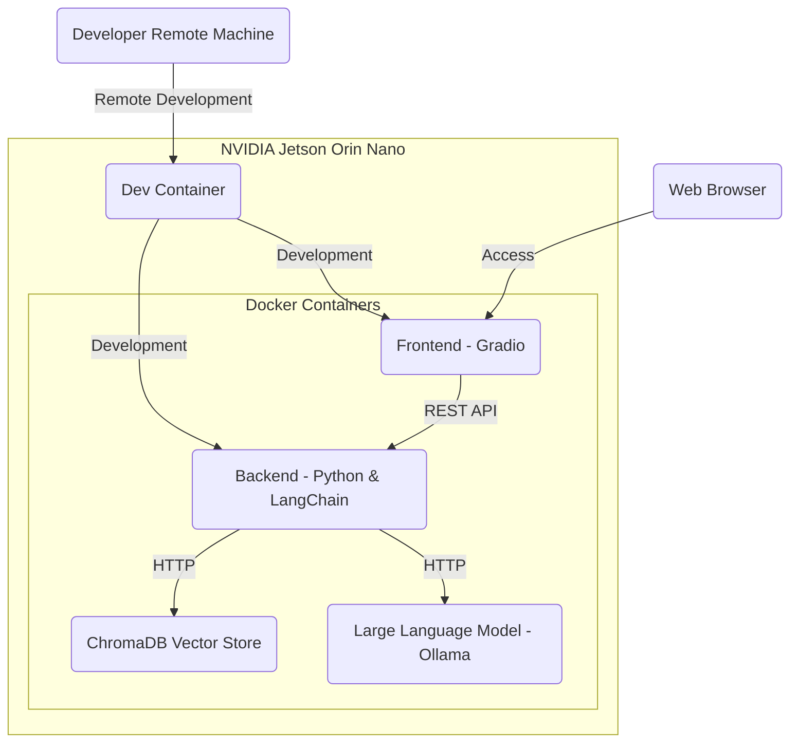
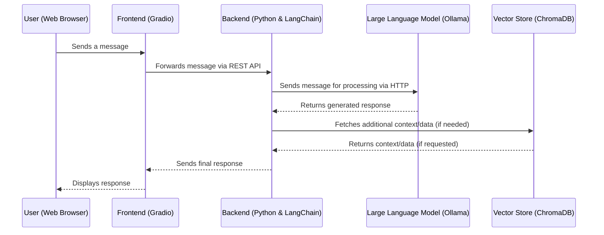

# Workshop: Build Your Own Chatbot

Welcome to the "Build Your Own Chatbot" workshop! This workshop will guide you through the process of creating a custom chatbot using Large Language Models (LLMs) as the core technology. By the end of this workshop, you'll have a functional chatbot that can serve as a personalized learning assistant, an interactive study tool, and a reliable support for exam preparation.

## Workshop Objectives

By participating in this workshop, you will achieve the following:

- **Personalized Learning Assistant**: Create a chatbot that acts as a learning tutor.
- **Interactive Study Tool**: Upload lecture scripts, ask questions about the content, or generate exam-related questions.
- **Exam Preparation Support**: Use the chatbot to reinforce your understanding of key topics.

## Overview

In this workshop, we will build a chatbot using an LLM as the core engine, complemented by a frontend and backend to provide a complete, user-friendly solution.

### Key Concepts

- **Frontend**: A graphical user interface (GUI) for interacting with the chatbot.
- **Backend**: Handles the core functionality and logic of the chatbot.
- **Retrieval-Augmented Generation (RAG)**: A hybrid approach that combines information retrieval with text generation to enhance chatbot responses.

Below is a diagram code that explains the general concept of Retrieval-Augmented Generation (RAG), which combines retrieval-based methods with generative models to enhance the generation of text responses.


### Target Architecture

The chatbot solution is designed with the following architecture:



### Components Explained

1. **NVIDIA Jetson Orin Nano**: The hardware platform hosting all Docker containers necessary for the chatbot.

2. **Docker Containers**:
    - **Frontend (Gradio)**: The user interface for interacting with the chatbot.
    - **Backend (Python & LangChain)**: Manages chatbot logic, processes inputs, and interfaces with other components.
    - **LLM (Ollama)**: Handles natural language processing tasks.
    - **VectorStore (ChromaDB Vector Store)**: Manages vector representations of text data for efficient querying.

3. **Development and Communication Flow**:
    - **Frontend to Backend**: Communication via REST API.
    - **Backend to LLM and VectorStore**: Interaction through HTTP requests.
    - **Development Environment**: Dev Container allows development within an isolated environment on the NVIDIA Jetson Orin Nano.

### User Interaction Flow



This diagram illustrates the flow of data during a typical user interaction with the chatbot, highlighting how the components communicate to generate and display responses.

## Getting Started

This repository serves as the project template for the workshop.

### Tools and Technologies

The project utilizes the following tools and technologies:

- **[Rye](https://rye.astral.sh/)**: Manages dependencies and virtual environments.
- **[Pytest](https://docs.pytest.org/)**: Framework for writing and running unit tests.
- **[Pyright](https://microsoft.github.io/pyright/)**: Static type checker and linter for Python.
- **[Ruff](https://docs.astral.sh/ruff/)**: Linter configured in the `pyproject.toml` file.
- **[Pre-Commit](https://pre-commit.com/)**: Tool for running checks before committing code.

### Tool Installation

1. **Install Rye**: Follow the [Rye installation guide](https://rye.astral.sh/guide/installation/).
2. **Install Dependencies**:
   - Sync the project dependencies within a virtual environment:
     ```sh
     rye sync
     ```
   - **Alternatively**, install dependencies manually:
     ```sh
     pip install -r requirements.lock
     pip install -r requirements-dev.lock
     ```

3. **Configure Python Interpreter**: Set your VSCode to use the `.venv` environment created by Rye.
4. **Set Up Environment Variables**:
   - Duplicate the `.env.example` file and rename it to `.env`.
   - Fill in the required fields in the `.env` file.

### Project Configuration

Update the project metadata in `pyproject.toml`:

```toml
[project]
description = "Add your description here"
authors = [
    { name = "Max", email = "Max@example-project-with-rye.com" }
]
```

## Usage

<details>
<summary><b><span style="font-size: large;">Additional Developer Commands (Click to expand)</span></b></summary>

### Dependency Management

- **Add LangChain as a regular dependency**:
  ```sh
  rye add langchain
  ```

- **Add Pytest as a development dependency**:
  ```sh
  rye add pytest --dev
  ```

- **Update a specific package**:
  ```sh
  rye sync --update langchain
  ```

- **Update all packages**:
  ```sh
  rye sync --update-all
  ```

- **Update Rye itself**:
  ```sh
  rye self update
  ```

### Code Quality and Formatting

- **Linting**: Find and automatically fix lint errors:
  ```sh
  rye lint --fix
  ```

- **Static Type Checking**:
  ```sh
  pyright
  ```

- **Auto-Format Code**:
  ```sh
  rye fmt
  ```

### Pre-Commit Hooks

- **Install Pre-Commit Hooks**: Automatically run checks before each commit.
  ```sh
  pre-commit install --hook-type pre-commit
  ```

- **Run Pre-Commit Hooks on Staged Files**:
  ```sh
  pre-commit run
  ```

- **Run Pre-Commit Hooks on All Files**:
  ```sh
  pre-commit run --all-files
  ```

- **Update Pre-Commit Hooks**:
  ```sh
  pre-commit autoupdate
  ```

</details>

---